# Text Display Package

## Introduction
Author: Sirui (Ray) Huang (with help from Sizhe Chen) and any sources referenced in the code.

Description:
This text display package is an optimized version of the original text display module created for in 15-466 game4. Functionalities include rendering texts in different fonts, sizes, scales, colors at any position in the drawable space. Compatiblility with ```Load.hpp``` is supported. Projection matrix is orthographic, so perspective is not supported. 

Please feel free to point out bugs and make changes to this package!

## Catalog
This package contains the following files:
- ```README.md```: This document.
- ```TextDisplay.hpp```: Header file of struct ```TextDisplay```.
- ```TextDisplay.cpp```: Cpp file implementing ```TextDisplay```.
- ```ColorTextProgram.hpp```: Header file of openGL program ```color_text_program```.
- ```ColorTextProgram.hpp```: Cpp file containing the program specifics.
- ```demo_images/```: Folder containing demo images for ```README.md```.

## Implementation
Text Drawing is realized using HarfBuzz buffers to read FreeType fonts and rendering them using openGL VBO. FreeType reads font and fills in bitmaps for VBO. HarfBuzz buffers provide sizes, advances, and offsets of glyphs, mcuh simplifying the rendering procedure. This process is realized in the newly created utility files TextDisplay.hpp and TextDisplay.cpp, along with the openGL program ColorTextProgram (referenced from OpenGL Text Rendering Chapter).

## Usage
### Preparation
To use this package, place all four files in the main directory. 

In the file where you plan to render text (```PlayMode.cpp``` most of the time), add the line ```#include TextDisplay.hpp```. 

Also, add ```maek.CPP('TextDisplay.cpp')``` and ```maek.CPP('ColorTextProgram.cpp')``` to ```game_names``` in ```Maekfile.js``` to build correctly.

### Creating Text Object
To create a TextDisplay object with your chosen font, use ```Load< T >```. Below is an example using [Mooli](https://fonts.google.com/specimen/Mooli?query=Mooli).
```cpp
Load< TextDisplay > text_display(LoadTagDefault, []() -> TextDisplay const * {
	return new TextDisplay(data_path("Mooli-Regular.ttf"));
});
```
Now you can call the main display function ```show_text``` using ```test_display```:
```cpp
text_display->show_text("Hello CGProgramming!", drawable_size, -1.0f, -1.0f, 72, 1.0f, glm::vec3(1.0f, 1.0f, 1.0f));
```
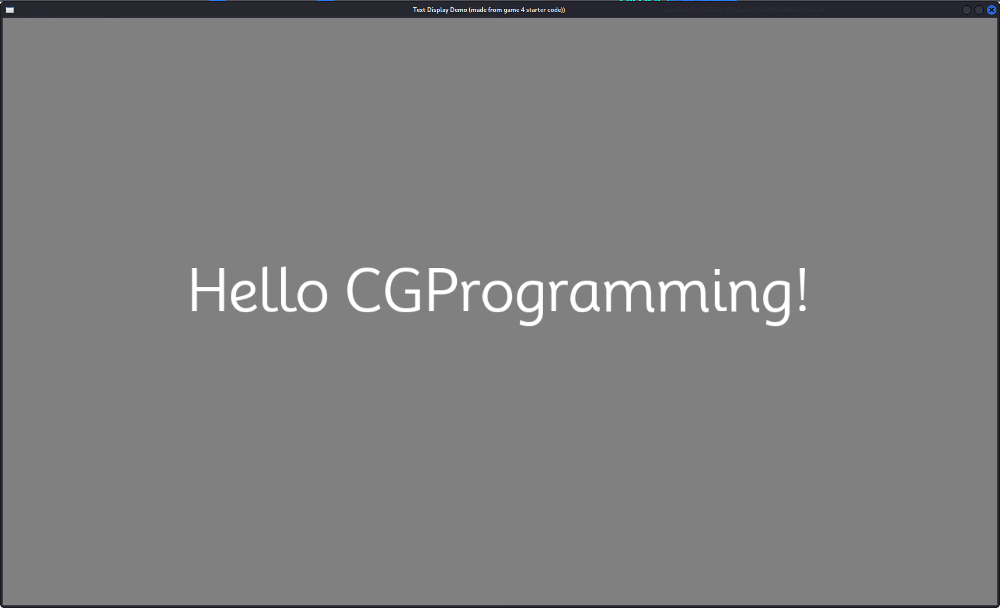

Example using [NotoSansSC](https://fonts.google.com/noto/specimen/Noto+Sans+SC?query=chinese):
```
Load< TextDisplay > text_display(LoadTagDefault, []() -> TextDisplay const * {
	return new TextDisplay(data_path("NotoSansSC-VariableFont_wght.ttf"));
});
```
```cpp
text_display->show_text("终有一日双星会临近洛希极限", drawable_size, -1.0f, -1.0f, 72, 1.0f, glm::vec3(1.0f, 1.0f, 1.0f));
```
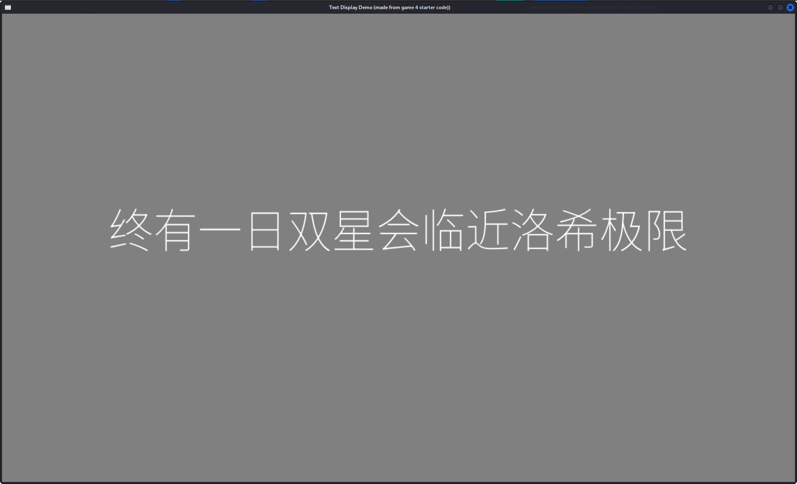

### Render Text
The font used the following demos is [Mooli](https://fonts.google.com/specimen/Mooli?query=Mooli).

```show_text``` is the main display function. Its declaration is as below:
```cpp
void show_text(
  std::string const &text, 
  glm::uvec2 const &drawable_size, 
  float const &x_in, 
  float const &y_in, 
  int const &size, 
  float const &scale, 
  glm::vec3 const &color
) const;
```
#### ```text```:
The text you want to display.
```cpp
text_display->show_text("Byebye CGProgramming!", drawable_size, -1.0f, -1.0f, 72, 1.0f, glm::vec3(1.0f, 1.0f, 1.0f));
```
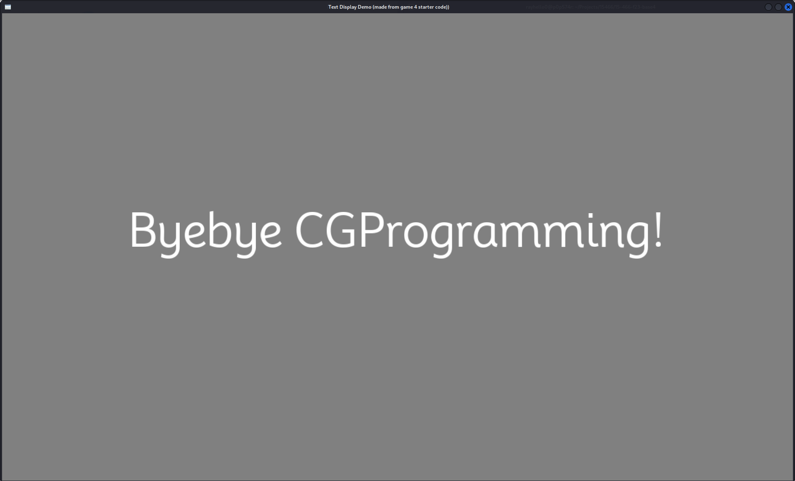

#### ```drawable_size```:
Pass in the drawable size for your game. It is passed as a parameter in ```PlayMode::draw```.

#### ```x_in``` and ```y_in```:
The position you specify your text to be displayed.
If ```x_in```/```y_in``` is assigned a value no less than 0, the text will be displayed with the assigned value as the starting position to draw.
```cpp
text_display->show_text("Hello CGProgramming!", drawable_size, 100.0f, 200.0f, 72, 1.0f, glm::vec3(1.0f, 1.0f, 1.0f));
```
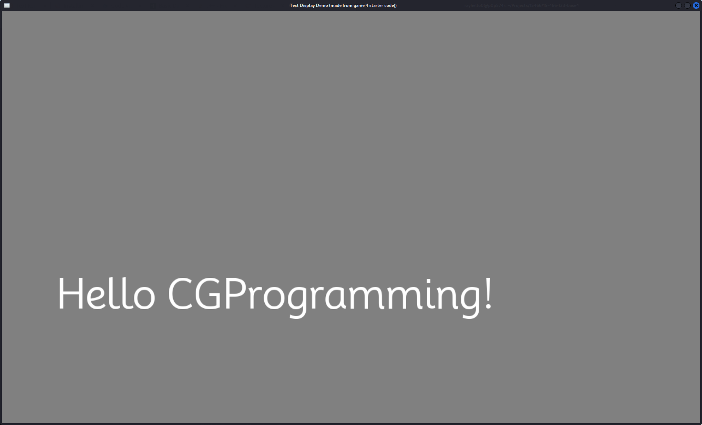

If ```x_in```/```y_in``` is assigned a value no less than 0, the text will be dichotomically displayed. See the following examples.

For ```x_in```/```y_in```, a value of -1.0f will make the text appear at the center.
```cpp
text_display->show_text("Hello CGProgramming!", drawable_size, -1.0f, -1.0f, 36, 1.0f, glm::vec3(1.0f, 1.0f, 1.0f));
```
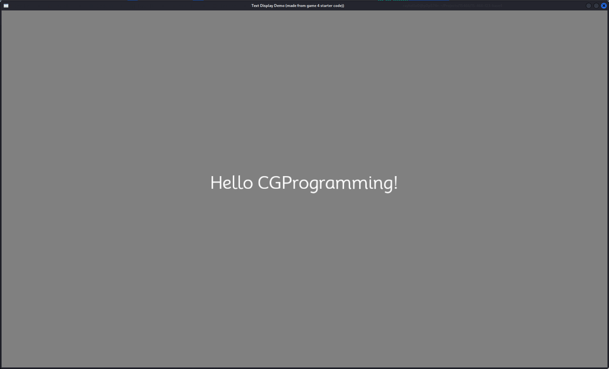

If ```x_in``` is -2.0f, the text will appear at 1/4 position left of the drawable space.
```cpp
text_display->show_text("Hello CGProgramming!", drawable_size, -2.0f, -1.0f, 36, 1.0f, glm::vec3(1.0f, 1.0f, 1.0f));
```
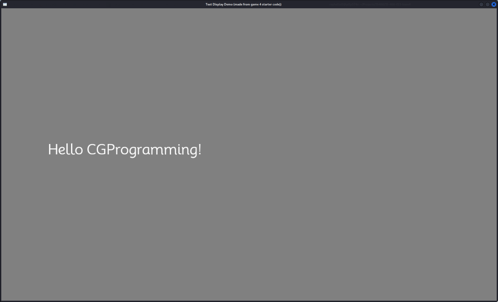

If ```x_in``` is -3.0f, the text will appear at 3/4 position right of the drawable space.
```cpp
text_display->show_text("Hello CGProgramming!", drawable_size, -3.0f, -1.0f, 36, 1.0f, glm::vec3(1.0f, 1.0f, 1.0f));
```
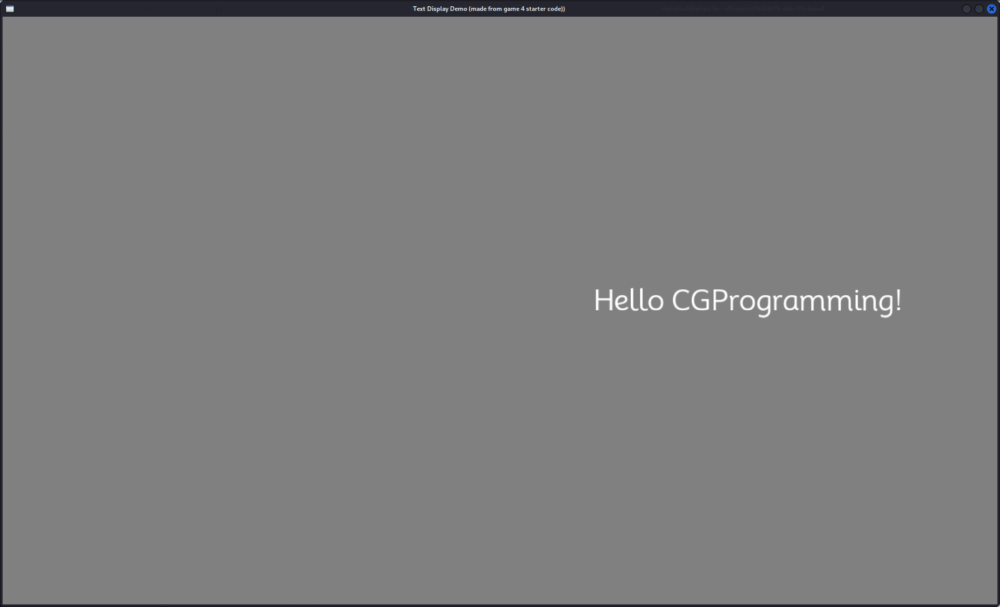

-4.0f will be 1/8, -5.0f will be 3/8, -8.0f will be 1/16, etc.

The same logic applies to ```y_in```. y position will go bottom-up as the absolute value of ```y_in``` increases before it reaches some power of 2.
```cpp
text_display->show_text("Hello CGProgramming!", drawable_size, -1.0f, -2.0f, 36, 1.0f, glm::vec3(1.0f, 1.0f, 1.0f));
```
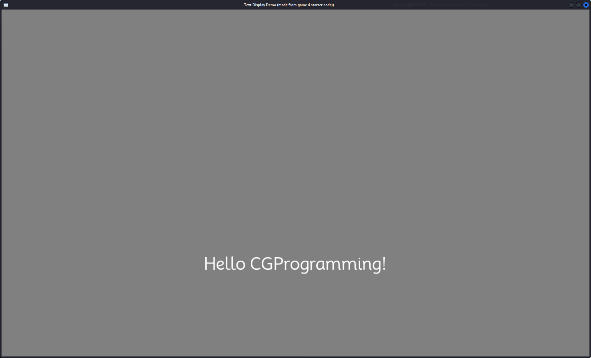

Of course, you can let ```x_in``` and ```y_in``` be dichotomic at the same time.
```cpp
text_display->show_text("Hello CGProgramming!", drawable_size, -2.0f, -3.0f, 36, 1.0f, glm::vec3(1.0f, 1.0f, 1.0f));
```
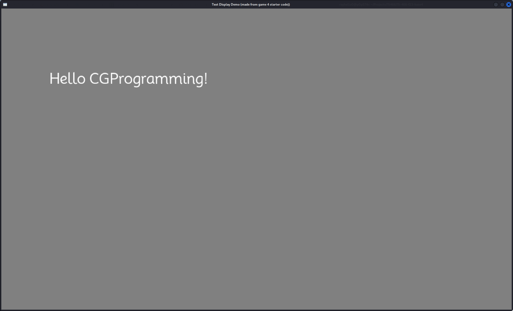

Or mix it up where one of ```x_in``` and ```y_in``` is absolute position and the other one is dichotomic position.
```cpp
text_display->show_text("Hello CGProgramming!", drawable_size, -1.0f, 550.0f, 72, 1.0f, glm::vec3(1.0f, 1.0f, 1.0f));
```
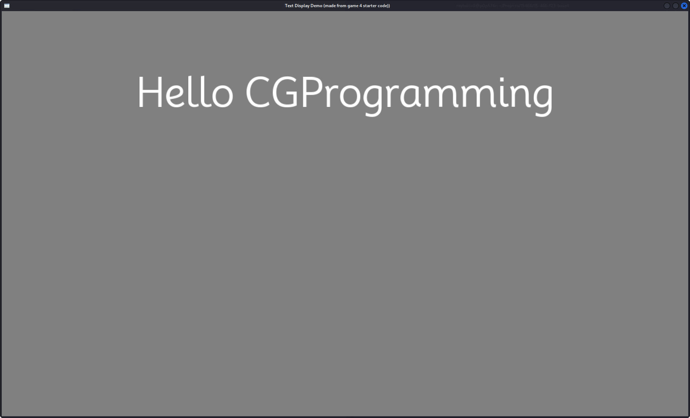

**Note**: If ```x_in```/```y_in``` is assigned a negative float that has digits after the floating point, it will be rounded down (e.g. -3.1415f to -4.0f).

#### ```size```:
The font size of your text.
```cpp
text_display->show_text("Hello CGProgramming!", drawable_size, -1.0f, -1.0f, 108, 1.0f, glm::vec3(1.0f, 1.0f, 1.0f));
```
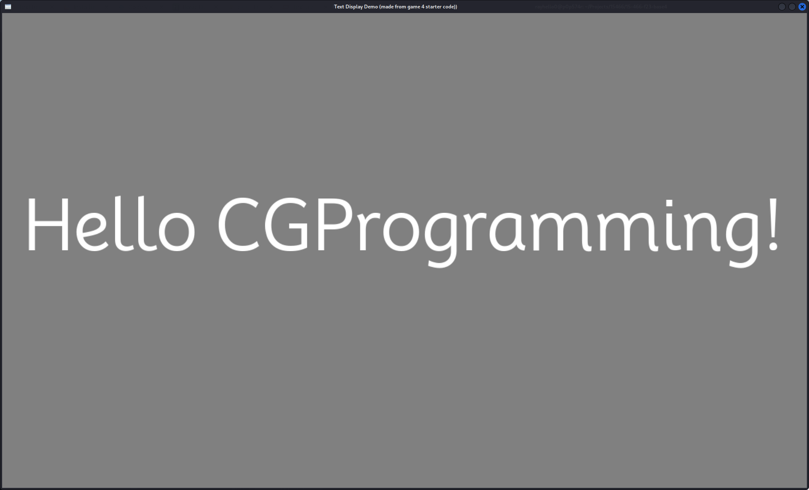

#### ```scale```:
The scale of your text. Note this is different from the font size. The rendered text is scaled with the font size unchanged. If you set ```scale``` to a large value, the rendered text will become blurry.
```cpp
text_display->show_text("Hello CGProgramming!", drawable_size, -1.0f, -1.0f, 72, 1.5f, glm::vec3(1.0f, 1.0f, 1.0f));
```
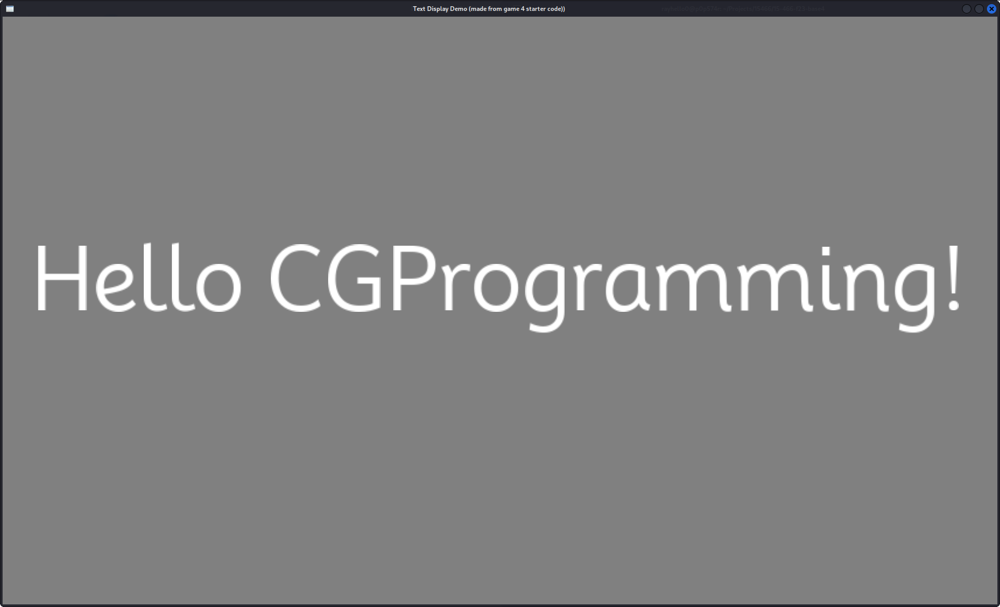

#### ```color```:
The color of your text. The color is a ```glm::vec3``` with each component ranging from 0.0f to 1.0f.
```cpp
text_display->show_text("Hello CGProgramming!", drawable_size, -1.0f, -1.0f, 72, 1.0f, glm::vec3(0.5f, 1.0f, 1.0f));
```
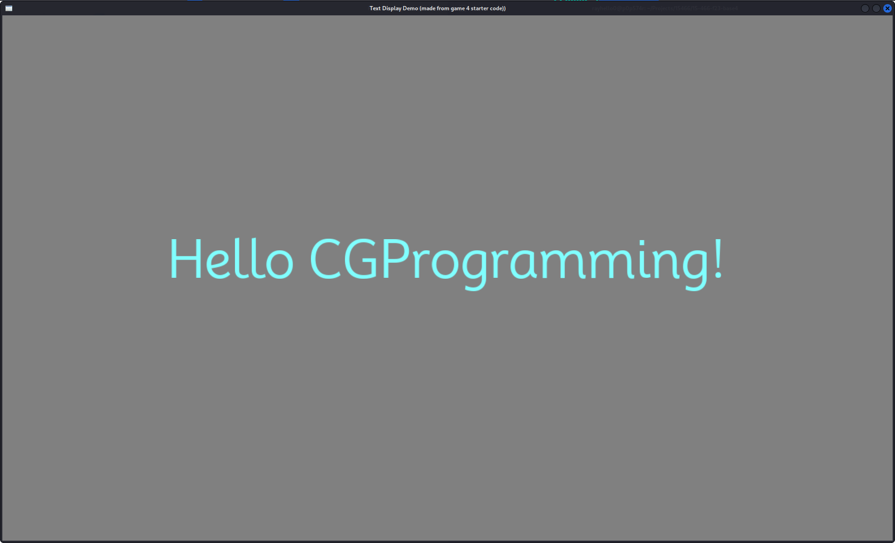
```cpp
text_display->show_text("Hello CGProgramming!", drawable_size, -1.0f, -1.0f, 72, 1.0f, glm::vec3(0.0f, 0.0f, 0.0f));
```
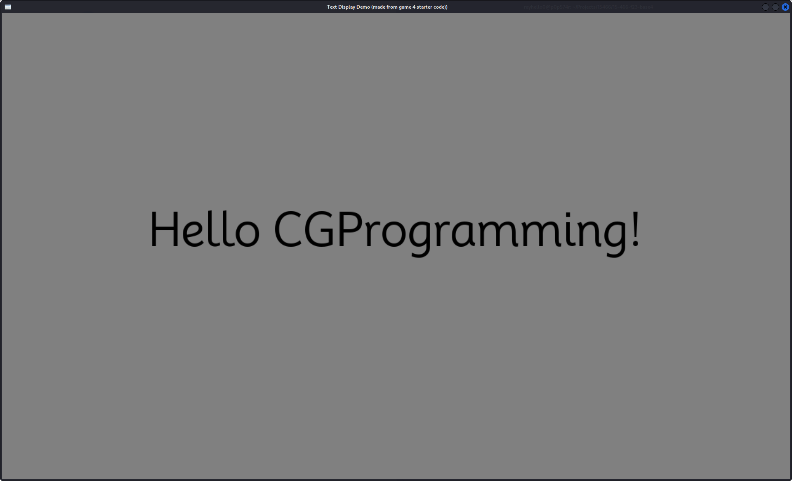

## Acknowledgements
This package is created referring to the following sources:
> 15466 game4 base code: https://github.com/15-466/15-466-f22-base4

> The online book for learning OpenGL, specifically the chapter on Text Rendering: https://learnopengl.com/In-Practice/Text-Rendering

> The code example from learning OpenGL: https://learnopengl.com/code_viewer_gh.php?code=src/7.in_practice/2.text_rendering/text_rendering.cpphttps://github.com/harfbuzz/harfbuzz-tutorial/blob/master/hello-harfbuzz-freetype.c

> Harfbuzz manual: https://harfbuzz.github.io/index.html

> Harfbuzz Tutorial: https://github.com/harfbuzz/harfbuzz-tutorial/blob/master/hello-harfbuzz-freetype.c

> FreeType Tutorial: https://freetype.org/freetype2/docs/tutorial/index.html

Other resources used:
[Mooli](https://fonts.google.com/specimen/Mooli?query=Mooli),[NotoSansSC](https://fonts.google.com/noto/specimen/Noto+Sans+SC?query=chinese).